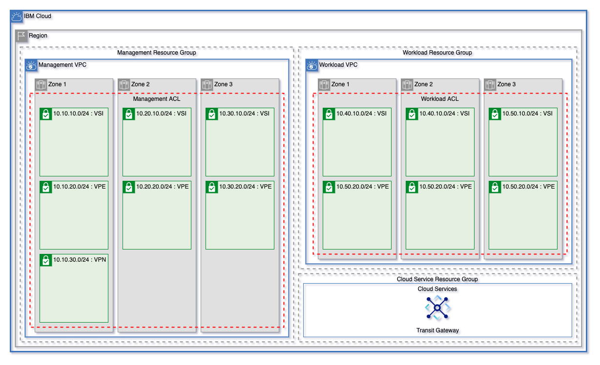

# Default Landing Zone Configuration

## Table of Contents

1. [Pattern Variables](#pattern-variables)
2. [Resource Groups](#resource-groups)
3. [Cloud Services](#cloud-services)
    - [Key Management](#key-management)
    - [Cloud Object Storage](#cloud-object-storage)
    - [Activity Tracker](#activity-tracker)
4. [VPC Infrastructure](#vpc-infrastructure)
    - [Network Access Control Lists](#network-access-control-lists)
    - [Subnets](#subnets)
    - [Flow Logs](#flow-logs)
    - [Virtual Private Endpoints](#virtual-private-endpoints)
5. [Deployments]

---

## Pattern Variables

Each Landing Zone pattern takes in a small number of variables, enabling you to quickly and easily get started with IBM Cloud. Each pattern requires only the `ibmcloud_api_key`, `prefix`, and `region` variables to get started (the `ssh_public_key` must also be provided by the user when creating a pattern that uses Virtual Servers). 

### Variables Available in Each Pattern

Name                     | Type         | Description                                                                                                                                                                     | Sensitive | Default
------------------------ | ------------ | ------------------------------------------------------------------------------------------------------------------------------------------------------------------------------- | --------- | ----------------------------------
ibmcloud_api_key         | string       | The IBM Cloud platform API key needed to deploy IAM enabled resources.                                                                                                          | true      | 
TF_VERSION               | string       | The version of the Terraform engine that's used in the Schematics workspace.                                                                                                    |           | 1.0
prefix                   | string       | A unique identifier for resources. Must begin with a letter. This prefix will be prepended to any resources provisioned by this template.                                       |           | 
region                   | string       | Region where VPC will be created. To find your VPC region, use `ibmcloud is regions` command to find available regions.                                                         |           | 
tags                     | list(string) | List of tags to apply to resources created by this module.                                                                                                                      |           | []
vpcs                     | list(string) | List of VPCs to create                                                                                                                                                          |           | ["management", "workload"]
enable_transit_gateway   | bool         | Create transit gateway                                                                                                                                                          |           | true
hs_crypto_instance_name  | string       | Optionally, you can bring you own Hyper Protect Crypto Service instance for key management. If you would like to use that instance, add the name here. Otherwise, leave as null |           | null
hs_crypto_resource_group | string       | If you're using Hyper Protect Crypto services in a resource group other than `Default`, provide the name here.                                                                  |           | null
override                 | bool         | Override default values with custom JSON template. This uses the file `override.json` to allow users to create a fully customized environment.                                  |           | false

### Variables for Patterns Including Virtual Servers

For the [mixed pattern](./patterns/mixed/) and [vsi pattern](./patterns/vsi)

Name                     | Type         | Description                                                                                                                                                                     | Sensitive | Default
------------------------ | ------------ | ------------------------------------------------------------------------------------------------------------------------------------------------------------------------------- | --------- | ----------------------------------
ssh_public_key           | string       | Public SSH Key for VSI creation.                                                                                                                                                |           | 
vsi_image_name           | string       | VSI image name. Use the IBM Cloud CLI command `ibmcloud is images` to see availabled images.                                                                                    |           | ibm-ubuntu-16-04-5-minimal-amd64-1
vsi_instance_profile     | string       | VSI image profile. Use the IBM Cloud CLI command `ibmcloud is instance-profiles` to see available image profiles.                                                               |           | cx2-2x4
vsi_per_subnet           | number       | Number of Virtual Servers to create on each VSI subnet.                                                                                                                         |           | 1

### Variables for Patterns Including OpenShift Clusters

For the [mixed pattern](./patterns/mixed/) and the [roks pattern](./patterns/roks/) these variables are available to the user.

Name                     | Type         | Description                                                                                                                                                                     | Sensitive | Default
------------------------ | ------------ | ------------------------------------------------------------------------------------------------------------------------------------------------------------------------------- | --------- | ----------------------------------
zones                    | number       | Number of zones to provision clusters for each VPC. At least one zone is required. Can be 1, 2, or 3 zones.                                                                                                                                                                                                                                                                                                                                                                         |           | 3
flavor                   | string       | Machine type for cluster. Use the IBM Cloud CLI command `ibmcloud ks flavors` to find valid machine types                                                                                                                                                                                                                                                                                                                                                                           |           | bx2.16x64
workers_per_zone         | number       | Number of workers in each zone of the cluster. OpenShift requires at least 2 workers per sone for high availability.                                                                                                                                                                                                                                                                                                                                                                |           | 2
wait_till                | string       | To avoid long wait times when you run your Terraform code, you can specify the stage when you want Terraform to mark the cluster resource creation as completed. Depending on what stage you choose, the cluster creation might not be fully completed and continues to run in the background. However, your Terraform code can continue to run without waiting for the cluster to be fully created. Supported args are `MasterNodeReady`, `OneWorkerNodeReady`, and `IngressReady` |           | IngressReady

---

## Resource Groups

Each of these resource groups will have the `prefix` variable and a hyphen prepended to the name (ex. `slz-management-rg` if the prefix is `slz`).

Name            | Description
----------------|------------------------------------------------
`management-rg` | Management Virtual Infrastructure Components
`workload-rg`   | Workload Virtual Infrastructure Components
`service-rg`    | Cloud Service Instances

---

## Cloud Services

### Key Management

By default a Key Protect instance is created unless the `hs_crypto_instance_name` variable is provided. Key Protect instances by default will be provisioned in the `service-rg` resource group.

---

#### Keys

Name            | Description
----------------|------------------------------------------------
`atracker-key`  | Encryption key for Activity Tracker Instance
`slz-key`       | Landing Zone services encryption key

---

### Cloud Object Storage

Two Cloud Object Storage instances are created in the `service-rg` by default

Name            | Description
----------------|------------------------------------------------
`atracker-cos`  | Object storage for Activity Tracker
`cos`           | Object storage

---

#### Object Storage Buckets

Name                | Instance       | Encryption Key | Description
--------------------|----------------|----------------|---------------------------------------------
`atracker-bucket`   | `atracker-cos` | `atracker-key` | Bucket for activity tracker logs
`management-bucket` | `cos`          | `slz-key`      | Bucket for flow logs from Management VPC
`workload-bucket`   | `cos`          | `slz-key`      | Bucket for flow logs from Workload VPC

---

#### Object Storage API Keys

An API key is automatially generated for the `atracker-cos` instance to allow Activity Tracker to connect successfully to Cloud Object Storage

---

### Activity Tracker

An [Activity Tracker](url-here) instance is provisioned for this architecture.

---

## VPC Infrastructure

By default, two VPCs ae created `management` and `workload`. All the components for the management VPC are provisioned in the `management-rg` resource group and the workload VPC components are all provisioned in the `workload-rg` resource group.

---

### Network Access Control Lists

An [Access Control List](url-goes-here) is created for each VPC to allow inbound communiction within the network, inbound communication from IBM services, and to allow all outbound traffic.

Rule                        | Action | Direction | Source        | Destination 
----------------------------|--------|-----------|---------------|----------------
`allow-ibm-inbound`         | Allow  | Inbound   | 161.26.0.0/16 | 10.0.0.0/8
`allow-all-network-inbound` | Allow  | Inbound   | 10.0.0.0/8    | 10.0.0.0/8
`allow-all-outbound`        | Allow  | Outbound  | 0.0.0.0/0     | 0.0.0.0/0

---

### Subnets

Each VPC creates two tiers of subnets, each attached to the Network ACL created for that VPC. The Management VPC also has a subnet created for creation of the VPN Gateway

#### Management VPC Subnets

Name         | Zone | Subnet CIDR
-------------|------|-------------
`vsi-zone-1` | 1    | 10.10.10.0/24
`vpe-zone-1` | 1    | 10.10.20.0/24
`vpn-zone-1` | 1    | 10.10.30.0/24
`vsi-zone-2` | 2    | 10.20.10.0/24
`vpe-zone-2` | 2    | 10.20.20.0/24
`vsi-zone-3` | 3    | 10.30.10.0/24
`vpe-zone-3` | 3    | 10.30.20.0/24

#### Workload VPC Subnets

Name         | Zone | Subnet CIDR
-------------|------|-------------
`vsi-zone-1` | 1    | 10.40.10.0/24
`vpe-zone-1` | 1    | 10.40.20.0/24
`vsi-zone-2` | 2    | 10.50.10.0/24
`vpe-zone-2` | 2    | 10.50.20.0/24
`vsi-zone-3` | 3    | 10.60.10.0/24
`vpe-zone-3` | 3    | 10.60.20.0/24

---

### Flow Logs

Using the COS bucket provisioned for each VPC network, a flow log collector is created.

----

### Virtual Private Endpoints

Each VPC dyamically has a Virtual Private Endpoint addess for the `cos` instance created in each zone of that VPC's `vpe` subnet tier.

---

## Virtual Sever Deployments

---

## OpenShift Cluster Deployments

---