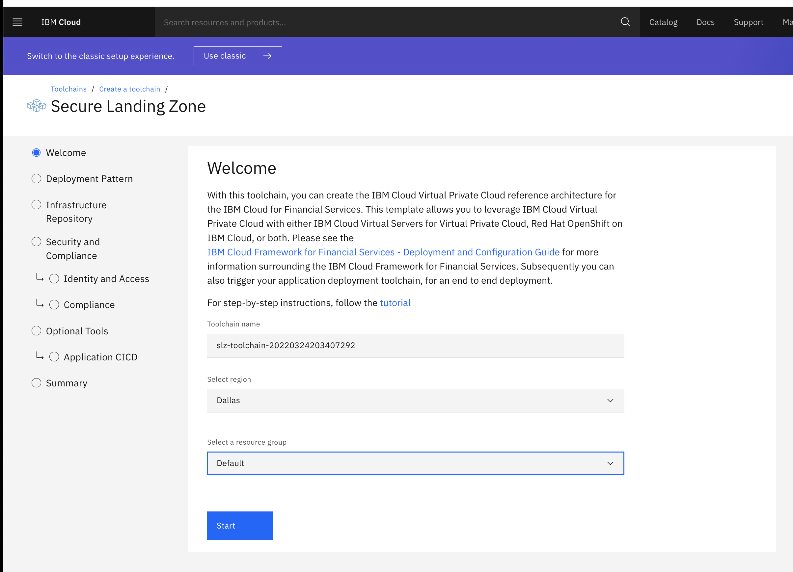

# IBM Cloud Toolchain Template for Secure Landing Zone 

The IBM Cloud Toolchain Template allows you to create a toolchain with values that you provide to the template.   

## Template Welcome Page

The Welcome page provides a brief introduction of the template.  At this page, you will provide information on the Toolchain:

- Name - the name toolchain that will be created.  By default the value will be *slz-toolchain-<timestamp>"
- Region - The region the toolchian will be created in.  *Dallas* is the default region.
- Resource Group - The resource group that the toolchain will be put in

## Deployment Pattern Page

On this page, you will select from a pre-defined pattern which include:

- [VSI's on VPC](../patterns/vsi-pattern.md) 
- [ROKS on VPC](../patterns/roks-pattern.md) 
- [Mixed architecture of VSI and ROKS on VPC](../patterns/mixed-pattern.md) 

Select which pattern you wish to use.

## Infrastructure Repository Page

On this page, you will provide a source provider and repository name where the source code will be cloned to.  Please provide the following inputs:

- Source Provider - Git Repos and Issue Tracking / Github / Gitlab / Github Enterprise Whitewater / Bitbucket
- Use boilerplate for the selected pattern / Bring your own IaC repository - You can use our selected patterns or bring your own IaC repository
- Repository name - The name of the repository that the source code will be cloned to

Note: You might have to Authorize to the selected repository.  Please see the [following](../prereqs/authorization.md) for more information. 

## Security and Compliance

In this section, you will provide information regarding your IBM Cloud API Key and Security and Compliance Center.

### Identity and Access Page

You can either click the new button to create a new IBM Cloud API Key or provide and existing one.

### Compliance

This page is currently a placeholder for future implementation.  Please continue onto the next page.

## Optional Tools

In this section, you can enable/disable optional tools that we provide.  The following tools can be configured:

### Application CI/CD

When you have the toggle switch set to enable for *Application CICD* you can set variables that will allow you to have your infrastructure toolchain invoke your application toolchain.  You application toolchain will be invoked via a webhook with the following configuration:

- Webhook URL - The POST URL used to trigger this webhook.
- Header Key - The key which contains the token. It can be a header name, query paramater name, a root level json payload property name or a form type payload key.
- Secret Token - The value of the secret token that is to be passed to the webhook.

## Summary Page

This page states if everything is defined that is needed for the toolchain.  You can now click the *Create Toolchain* button to create the toolchain.  For further instructions on the use of the toolchain, please see the [IBM Cloud Toolchain for Secure Landing Zone documentation](toolchain.md). 