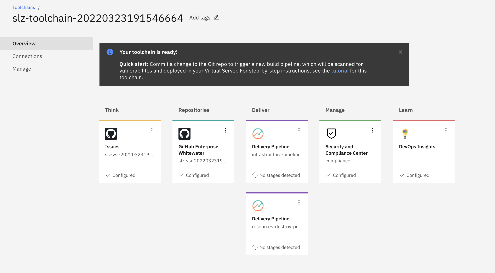

# IBM Cloud Toolchain for Secure Landing Zone 

A toolchain is a set of tools that allow Continuous Delivery of your code.  SLZ uses a toolchain to deploy the pattern of your choice to IBM Cloud.  The SLZ toolchain is comprised of multiple tools which include:

- Code repository (GitHub/Gitlab/Github Enterprise/Bitbucket)
- Delivery Pipelines 
- Devops Insights

## Delivery Pipelines

The SLZ toolchain is comprised of two delivery pipelines:  
- *infrastructure-pipeline*: Provisions your infrastructure to IBM Cloud
- *resources-destroy-pipeline*: Destroy your provisioned resource in IBM Cloud

### infrastructure-pipeline

The purpose of this pipeline is to provision and deploy your infrastructure.  If you click on the Delivery pipeline labeled *infrastructure-pipeline* you can access the pipeline.

#### Environment Properties

The pipeline is comprised of some environment properties which are passed to the run.  If you change them from here, they will persist over the different runs.  If you click *Run Pipeline* you can change them here also but they will not persist over other runs of the pipeline.  Below explains what each property is and what values you can set for each.

| Name | Default | Description |
|------|---------|-------------|
| apikey | | The IBM Cloud API Key you set during the creation of the toolchain |
| app-cicd-header-key | not set | The CICD Header Key |
| app-cicd-token | not set | The CICD Token |
| app-cicd-webhookurl | not set | The CICD Webhook URL |
| pattern | vsi/mixed/roks | The pattern that you wish to use |
| pipeline-debug | false | Enable debug output within the pipeline (true/false) |
| repositoryForManualTrigger | <Your code repo> | The repository where the terraform code is in |
| schematics-wksp | slz-<pattern>-<timestamp> | The name of the schematics workspace to be created and used.  Do not change after first run otherwise a new workspace will be created |
| terraform-cmd | plan | terraform command to execute (plan/apply).  Value set to **plan** just runs the terraform plan. Value set to **apply**, provisions the resources    |

#### Triggers

Triggers specify what happens when a specified event occurs.  There are two triggers that are created automatically within the pipeline which can be disabled if you wish to not use it.  You can create you own triggers if you wish.  The triggers that are automatically created at pipeline creation time are:

- Manaul-Trigger: A user executed run of the pipeline via the **Run Pipeline** button
- github-commit: An execution of the pipeline is done when the git repository receives a commit.

### destroy-resources-pipeline

The purpose of this pipelines is to destroy the provisioned resources.  If you click on the Delivery pipeline labeled *destroy-resources-pipeline* you can access the pipeline.

NOTE: This pipeline will only delete the provisioned resources within terraform.  Your schematics workspace that is created at first execution of the *infrastructure-pipeline* will not be deleted through this pipeline

#### Environment Properties

The pipeline is comprised of some environment properties which are passed to the run.  If you change them from here, they will persist over the different runs.  If you click *Run Pipeline* you can change them here also but they will not persist over other runs of the pipeline.  Below explains what each property is and what values you can set for each.

| Name | Default | Description |
|------|---------|-------------|
| apikey | | The IBM Cloud API Key you set during the creation of the toolchain |
| confirm-deletion | no | Confirms deletion of the resources (yes/no).  You must set to yes to delete the resources |
| pipeline-debug | false | Enable debug output within the pipeline (true/false) |
| schematics-wksp | slz-<pattern>-<timestamp> | The name of the schematics workspace to be created and used.  Do not change after first run otherwise a new workspace will be created |

#### Triggers

Triggers specify what happens when a specified event occurs.  There is only one trigger that is created automatically within the pipeline which can be disabled if you wish to not use it.  You can also create any additional triggers if you like.  The triggers that are automatically created at pipeline creation time are:

- Manaul-Trigger: A user executed run of the pipeline via the **Run Pipeline** button