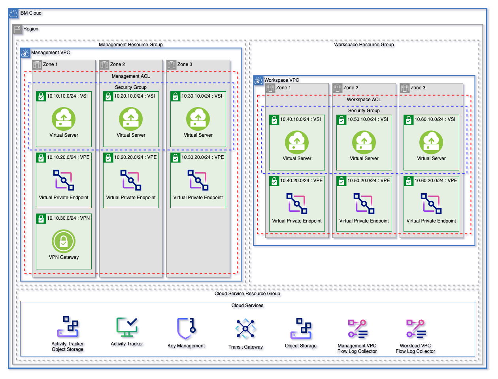
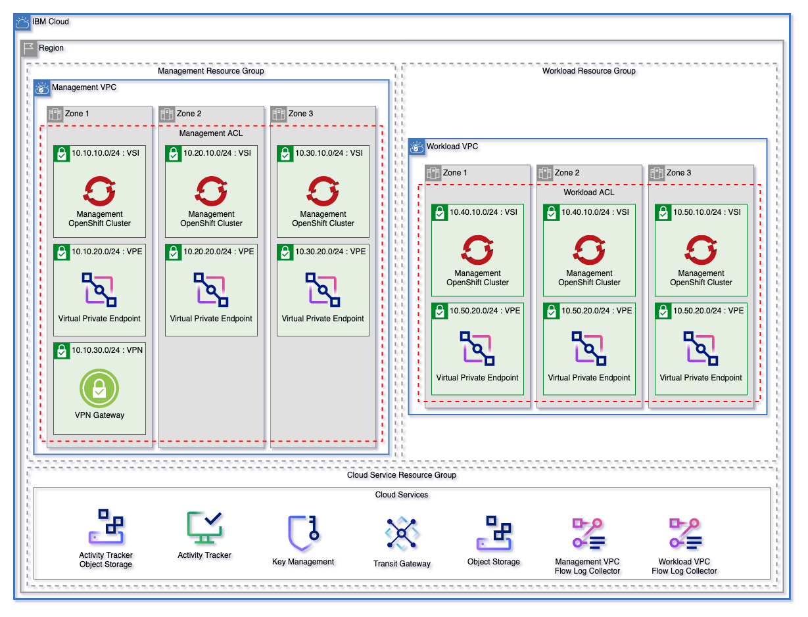
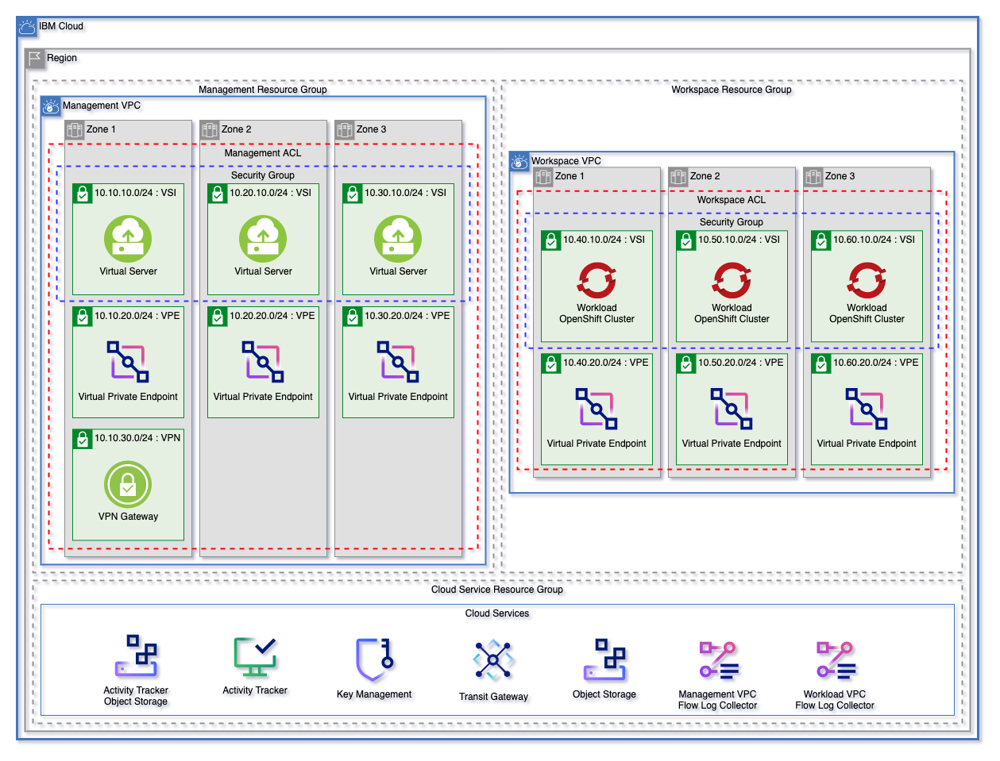

# IBM Secure Landing Zone

## Table of Contents

1. [Prerequisites](#prerequisites)
    1. [Setting Up an IBM Cloud Account](#setting-up-an-ibm-cloud-account)
    2. [Setup IBM Cloud Account for Secure Landing Zone](#setup-ibm-cloud-account-for-secure-landing-zone)
    3. [Setup Account Access (Cloud IAM)](#setup-account-access-cloud-iam)
    4. [Repository Authorization](#repository-authorization)
    5. [(Optional) Setting Up Hyper Protect Crypto Services](#optional-setting-up-hyper-protect-crypto-services)
2. [Patterns](#patterns)
3. [Getting Started](#getting-started)
4. [Default Landing Zone Configuration](#default-landing-zone-configuration)
    - [Pattern Variables](#pattern-variables)
    - [Resource Groups](#resoure-groups)
    - [Cloud Services](#cloud-services)
    - [VPC Infrastructure](#vpc-infrastructure)
5. [Customizing Your Environment](#customizing-your-environment)
6. [Running the Scripts Locally](#running-the-scripts-locally)
---

## Prerequisites

To ensure that Secure Landing Zone can be deployed, esure that the following steps have been completed before deployment.

---

### Setting Up an IBM Cloud Account

An IBM Cloud account is required. An Enterprise account is recommended but Pay as you Go account suffices to deploy secure landing zone cloud resources. 

If you do not already have an account, follow instructions [to create the account](https://cloud.ibm.com/docs/account?topic=account-account-getting-started#account-gs-createlite) and [upgrade to Pay-as-you-Go](https://cloud.ibm.com/docs/account?topic=account-account-getting-started#account-gs-upgrade)

- Have access to an [IBM Cloud account](https://cloud.ibm.com/docs/account?topic=account-account-getting-started). An Enterprise account is recommended but a Pay as you Go account should also work with this automation.

---

### Setup IBM Cloud Account for Secure Landing Zone

1. Log into IBM Cloud [console](https://cloud.ibm.com) using the IBMid you used to setup the account. This IBMid user is the account __owner__ and has all the IAM accesses.

2. [Complete the company profile and contacts information](https://cloud.ibm.com/docs/account?topic=account-contact-info) for the account. This is required to stay in compliance with IBM Cloud Financial Service profile.

3. [Enable the flag](https://cloud.ibm.com/docs/account?topic=account-enabling-fs-validated) to designate your IBM Cloud account to be Financial Services Validated.

4. Enable VRF and Service Endpoints. This requires creating a support case. Follow [instructions](https://cloud.ibm.com/docs/account?topic=account-vrf-service-endpoint#vrf) carefully.

---

### Setup Account Access (Cloud IAM)

1. [Create an IBM Cloud API Key](https://cloud.ibm.com/docs/account?topic=account-userapikey#create_user_key). User owning this key should be part of __admins__ group. **Necessary if manually provisioning**

2. [Setup MFA for all IBM Cloud IAM users](https://cloud.ibm.com/docs/account?topic=account-account-getting-started#account-gs-mfa).

3. [Setup Cloud IAM Access Groups](https://cloud.ibm.com/docs/account?topic=account-account-getting-started#account-gs-accessgroups). User access to cloud resources will be controlled using the Access Policies assigned to Access Groups. IBM Cloud Financial Services profile requires that all IAM users do not get assigned any accesses directly to any cloud resources. When assigning Access policies, Click "All Identity Access Enabled Services" from drop down menu.

---

### (Optional) Setting Up Hyper Protect Crypto Services

For Key Management services, user can optionally use Hyper Protect Crypto Services. This instance will need to be created before creating the Secure Landing Zone.

#### Hyper Crypto Service and Initialization

##### Creating HPCS Using the IBM Cloud CLI

To provision an instance of Hyper Protect Crypto Services IBM Cloud Console, complete the following steps:

1. Log in to your [IBM Cloud account](https://cloud.ibm.com).
2. Click Catalog to view the list of services that are available on IBM Cloud.
3. From the Catalog navigation pane, click Services. And then, under Category, select Security.
4. From the list of services displayed, click the Hyper Protect Crypto Services tile.
5. On the service page, select the pricing plan of choice.
6. Fill in the form with the details that are required.

##### Initializing HPCS

To initialize the provisioned Hyper Protect Crypto Service instance, we recommend to follow the product docs to perform the quick initialization.  

[Hyper Protect Cyrpto Service Documentation](https://cloud.ibm.com/docs/hs-crypto?topic=hs-crypto-get-started)

For proof of technology environments we recommend using the `auto-init` feature. [Auto Init Documentation](https://cloud.ibm.com/docs/hs-crypto?topic=hs-crypto-initialize-hsm-recovery-crypto-unit)  

-----

### Repository Authorization

The toolchain requires authorization to access your repository.  If it does not have access, the toolchain will request that you authorize access.  Below shows you how you can create a personal access token for your repository

- [GitHub and GitHub Enterprise](https://docs.github.com/en/authentication/keeping-your-account-and-data-secure/creating-a-personal-access-token)
- [GitLab](https://docs.gitlab.com/ee/user/profile/personal_access_tokens.html)
- [Bitbucket](https://confluence.atlassian.com/bitbucketserver/personal-access-tokens-939515499.html)

You can manage your authorizations via [Manage Git Authorizations](https://cloud.ibm.com/devops/git)

---

## Patterns

The [landing zone module](./landing-zone/) can be used to create a fully cusomizable VPC environment. The three patterns below are each starting templates that can be used to quickly get started with Landing Zone. These patterns can be found in the [patterns](./patterns/) directory.

Each of these patterns creates:
- A resource group for cloud services and for each VPC.
- Object storage instances for flow logs and activity tracker
- Encryption keys in either a Key Protect or Hyper Protect Crypto Services instance
- A management and workload VPC connected by a transit gateway
- A flow log collector for each VPC
- All nessecary networking rules to allow communication
- Virtual Private endpoints for Cloud Object storage in each VPC
- A VPN Gateway in the Management VPC

Each pattern will create an identical deployment on the VPC
- Virtual Server (VSI) Pattern will deploy identical virtual servers across the VSI subnet tier in each VPC
- Red Hat OpenShift Kubernetes (ROKS) Pattern will deploy identical clusters across the VSI subnet tier in each VPC
- The Mixed pattern will provision both of the above

---

### Detailed Default Pattern Configuration

To read more detailed documentation about the default configuration, read the pattern defaults [here](.docs/pattern-defaults.md).

---

### Virtual Server Pattern



---

### Red Hat OpenShift Pattern



---

### Mixed Pattern



---

## Getting Started 

**Whether provisioning with toolchain or running locally:**

**Both require editing `terraform.tfvars` with required variables noted by `"< add user data here >"`**

---

## Provisioning with the toolchain

You can provision an IBM Cloud Toolchain utilizing the template to create a CI/CD pipeline of executing Secure Landing zone.  Click the button below to start the process. 

Once completed process: 
1. Click Repository tile
2. Click Patterns directory
3. Choose the appropriate pattern, edit `terraform.tfvars` file and commit. 
4. Please read the [Working with IBM Cloud Toolchains](./.docs/toolchain/toolchain.md) for configuration and how to run the Toolchain 

[](https://cloud.ibm.com/devops/setup/deploy?repository=https://github.ibm.com/slz-v2-poc/landing-zone.git&env_id=ibm:yp:us-south&pipeline_type=tekton)

## Running the scripts locally

To run the scripts locally, follow these steps:

1. Install Terraform CLI and IBM Cloud Provider plug-in with [these steps](https://cloud.ibm.com/docs/ibm-cloud-provider-for-terraform?topic=ibm-cloud-provider-for-terraform-getting-started). Install [Python](https://www.python.org/downloads/).
2. Select the pattern that you want to provision (vsi/mixed/roks) within the patterns directory.
3. Provide your `tfvars` file with required variables, such as prefix, region, etc.
4. Provide your IBM Cloud API key through an environment variable (ex: export TF_VAR_ibmcloud_api_key="<YOUR IBM Cloud API Key>)
5. Run `terraform init` to initialize the working directory and configuration.
6. Run `terraform plan` to preview the changes that Terraform plans to make to your infrastructure.
7. Run `terraform apply` to execute the plan to create or modify your infrastructure.
8. Once you no longer need the infrastructure, you can run `terraform destroy` to delete the resources.

---

### Adding Additional VPCs

Additional VPC's can be added using the `terraform.tfvars` file by adding the name of the new VPC as a `string`.

```
vpcs  = ["management", "workload", "<ADDITIONAL VPC>"]
```

Provisioned [VPC components](./landing-zone/vpc)

---

### Overriding Variables

### Using override.json

To create a fully customized environment based on the starting template, users can use [override.json](./override.json) by setting the template `override` variable to `true`.

### Variable Definitions

By using the variable deifnitions found in our [landing zone module](../../landing-zone/) any number and custom configuration of VPC components, VSI workoads, and clusters can be created. Currently `override.json` is set to contain the default environment configuration.

### Customizing Your Environment

This module outputs `config`, a JSON encoded definition of your environment based on the defaults for Landing Zone and any variables changed using `override.json`. By using this output, it's easy to configure multiple additional workloads, VPCs, or subnets in existing VPCs to the default environment.

### Overriding Only Some Variables

`override.json` does not need to contain all elements. As an example override.json could be:
```json
{
    "enable_transit_gateway": false
}
```

----

## Creating an Issue

As we develop the SLZ template, issues are bound to come up. When an issue comes up the following are required. Issues that do not have complete information will be **closed immediately**.

### Enhancement Feature 

- A detailed title that is either the source of a bug, or a user story for the feature that needs to be added.
  - example `As a user, I want to be able to provision encryption keys using either HPCS or Key Protect`
- Any additional information about the use case is helpful, so please be sure to include it.

### Bug Fixes

- A detailed title that is either the source of a bug
  - example `When provisioning ROKS, network ALBs cannot be provisioned.`
- If you are creating an issue related to a bug, a list of non-sensitive variables in code block format being used to create the architecture must be added to the issue description. This will enable us to recreate the issue locally and diagnose any problems that occur
- Additionally, if there are any logging errors, please include those **as text or as part of a code block**.
